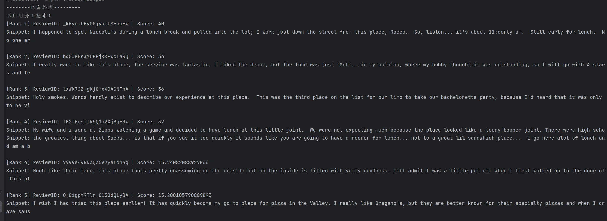

# yelp_data Search System

## 1.项目介绍
本系统是基于yelp_data数据集构建的评论检索系统，仅作为个人学习使用

### 1.1项目功能

1. 对**单个字符串**进行查询
2. 评估不同方法（目前支持基于词频的查询方法（TF）、TF-IDF算法和BM25算法）对**查询字符串列表**的效果（评估模式）
3. 根据城市（city）信息、企业类别（categories）信息和最低评分（min_star）信息，进一步筛选符合要求的评论（分面搜索）

### 1.2项目结构

```
yelp_data_search_system/
|——	data/
|	|——	yelp_training_set/	# 数据集
| | |—— PaxHeader/
| | |—— ._yelp_training_set_business.json
| | |—— ._yelp_training_set_review.json
| | |—— yelp_training_set_business.json
| | |—— yelp_training_set_review.json  # 你需要把下载的yelp_training_set_review.json文件放在这里
|——	test_data/	# 存放测试样例
|	|——	faceted_search_test.txt	# 分面搜索样例
|	|——	test_queries.txt	# 评估模式样例
|——	evaluator.py	# 评估模式
|——	faceted_search.py	# 分面搜索
|——	index_builder.py	# 索引构建
|——	main.py	# 主程序
|——	preprocess.py	# 数据预处理
|——	query_processor.py	# 查询处理
|——	ranker.py	# 排名函数
|——	README.md
|——	requirements.txt	# 环境配置
|——	yelp_training_set.zip	# 数据压缩包

```


## 2.开始使用

### 2.1使用前的环境配置

- 将项目中的 ` yelp_training_set.zip` 解压缩，放入`data`文件夹下，使项目结构和`1.2项目结构`中的结构图保持相同。

- 本项目依赖于`nltk`库的`punkt`和`stopwords`，虽然项目中提供了`download_nltk_resource()`函数对必要资源进行检测和自动下载，但我仍建议使用前先手动下载对应的资源。
- 请确保已安装`requirements.txt`中对应的库。

### 2.2对单个字符串进行查询

```bash
python main.py search -q "It looked like the place fills up pretty quickly so the earlier you get here the better" -m 'bm25' -tk 5 
```

运行上述命令，可对`"It looked like the place fills up pretty quickly so the earlier you get here the better"`使用`BM25`算法进行查询，程序会在控制台中输出得分最高的前5个评论的信息，结果如下图所示：



你可以设置其他查询参数进行个性化查询，可设置的参数见`main.py`代码。

### 2.3使用分面搜索进行增强查询

在普通查询命令中增加`--city`、`--categories`或`--min_star`参数，即可开启分面搜索，如：

```bash
python main.py search -q "It looked like the place fills up pretty quickly so the earlier you get here the better" -m 'bm25' -tk 5 --city "Phoenix" --categories "Breakfast & Brunch" "Restaurants" --min_star 3.0
```

其中：

* `--city`：企业所在的城市
* `--categories`：企业所属的类别
* `--min_star`：企业评分下限

开启分面搜索后程序只会在同时符合上述要求的企业的评论中进行查询，若查找不到符合要求的企业，会抛出异常，上述参数可以部分为空。

### 2.4评估不同方法对查询字符串列表的效果

```bash
python main.py evaluate -qf test_data/test_queries.txt -tk 10
```

运行上述命令，可对`test_queries.txt`中的查询字符串进行评估，你也可以使用自己的文件进行评估，只需要将命令修改成：

```bash
python main.py evaluate -qf your_file_path -tk 10
```

程序会基于**精确率(precision)**、**召回率(recall)**和**F1分数(f1_score)**进行评估，值得注意的是，在召回率计算中，<br>
$$recall = \frac{检索到真实相关的评论数量}{相关的评论数量}$$中，分母为所有的伪相关文档数量，而分子最多为命令中输入的`tk(top_k)`值，这意味着分母可能远远大于分子，召回率以及F1分数值会很小，故召回率以及F1分数仅作为参考，一般只关注精确率。

程序会将评估结果输出到`csv`文件中，默认输出路径是`./evaluate`

评估模式也可以开启分面搜索，此时默认输出的路径为`./evaluate/faceted`

相关参数说明见`main.py`代码。

**注：请确保你的txt文件只包含查询字符串，且每一行为一个查询字符串！！！**


